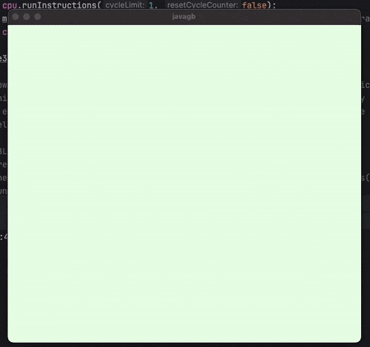

New attempt at GameBoy emulation.

Finish before Sep 2025.

### Recent Progress

- cpu and ppu are a lot more synchronised (still work to do)
- mbc1 implemented, seamless switching of roms with NoMBC to MBC1

### todo
- setting vblank interrupts
- ppu render penalties (likely cause of incomplete tiles)
